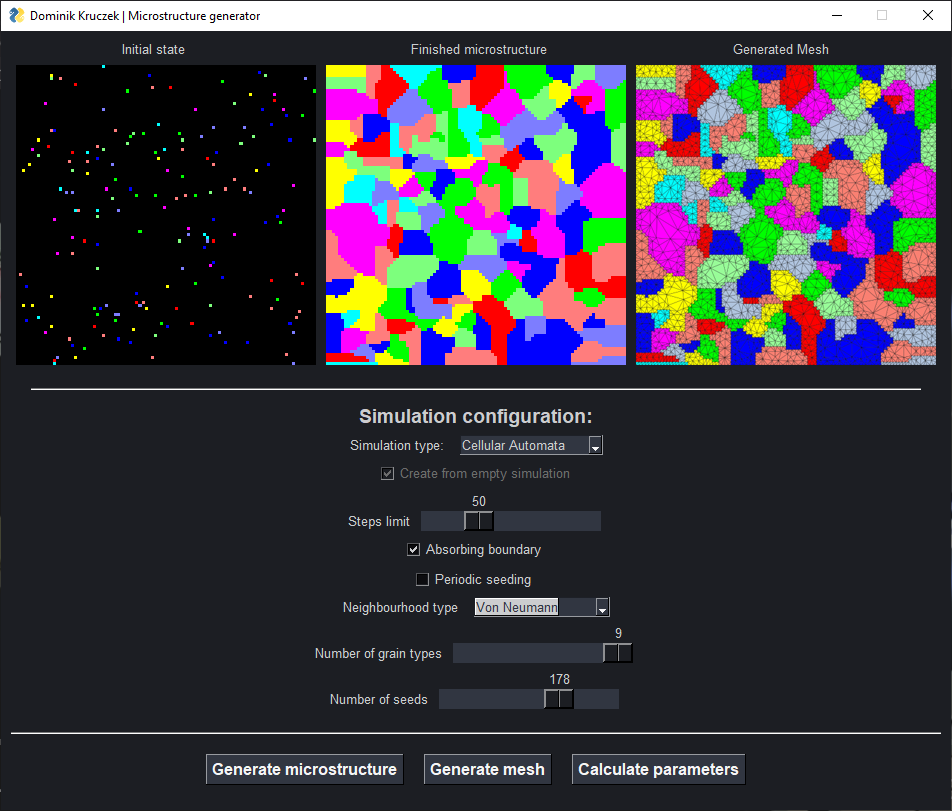
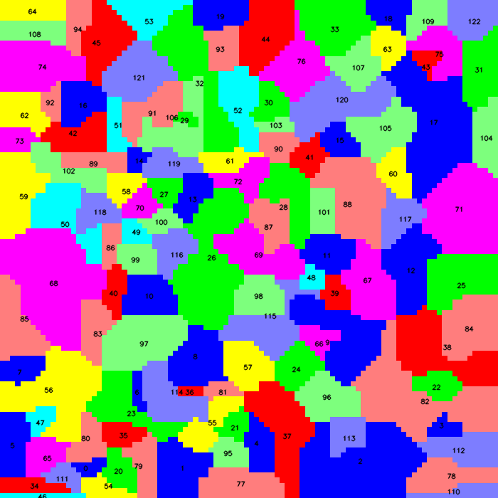
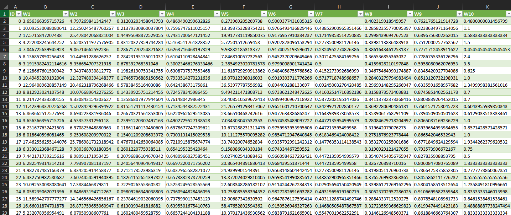
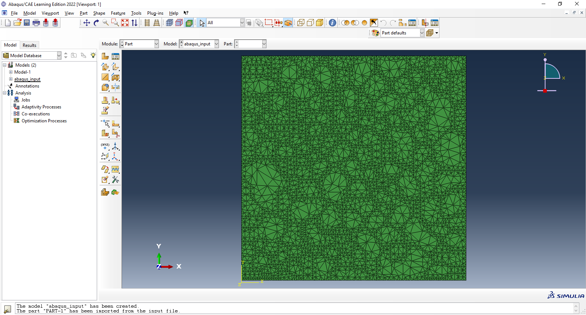

# Material Structure Simulation 

Plugin for [ABAQUS](https://solidexpert.com/programy/abaqus/) written using Python and PySimpleGUI. Generates grain
microstructure for steel-like materials using Cellular Automata and Monte Carlo methods. Then exports generated
structure as a mesh for simulation purposes in Abaqus Software. It also calculates multiple parameters of each grain
using OpenCV for image segmentation and processing. All outputs from the program are stored inside [output](output) folder

## Instructions

1. Download the repo
2. Make sure you have installed necessary libraries
3. Run [mainApp.py](mainApp.py) to display generation window
4. Generate desired microstructure
5. Generate mesh from the microstructure
6. *Optional* Calculate properties of each grain
7. Open Abaqus and import your [input file](output/abaqus_input.inp)

## Features

- Metal grain structure generation
- Generation using Cellular Automata
- Generation using Monte Carlo method
- Mesh generation from microstructure image
- Abaqus Input file generation
- Calculation of grain properties
- Saving said properties in csv format, alongside image with labeled grains
- All wrapped up in minimalistic GUI

## Screenshots

## Technologies

- Python
- PySimpleGUI
- Pillow
- OpenCV
- [MicroStructPy](https://docs.microstructpy.org/en/latest/)

## Authors

- [@dkrucze](https://github.com/TheKiromen)
